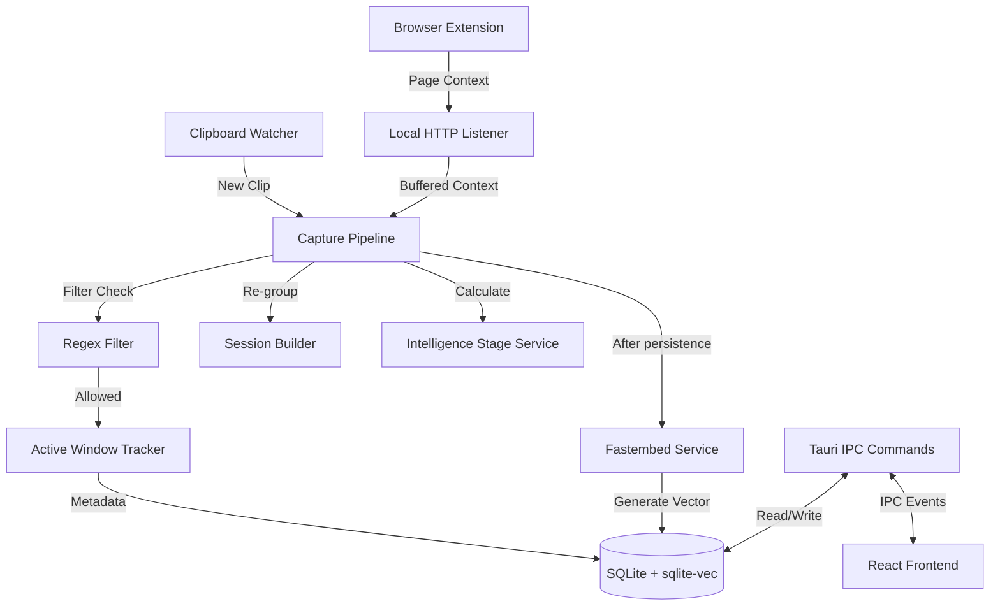

# Mnemo Architecture & Design Specification

This specification documents the finalized design and implementation decisions for the **Mnemo** desktop app, resolved through our collaborative alignment session.

## System Architecture

## Core Decisions

1. Rust owns SQLite, WAL initialization, sqlite-vec, FTS5, migrations, and all structured database access.
2. Sensitive-content rules are seeded in SQLite and run before persistence; Settings exposes rule CRUD.
3. Active-window metadata uses `active-win-pos-rs`, platform utilities as fallback, then `Unknown`.
4. FastEmbed loads in the background after window boot. While unavailable, the UI reports preparation and search uses FTS only.
5. A local Rust heuristic engine labels sessions and topic tags without an external LLM.
6. The hidden `popup` window is pre-created and shown by `CmdOrCtrl+Shift+V`; it hides on blur or Escape.
7. The memory graph uses a custom canvas with `d3-force` for palette and interaction control.
8. React 19, TypeScript, Vite, and Tailwind 4 use CSS-defined Cream/Amber theme tokens in `src/index.css`.
9. Ollama settings and Rust service boundaries exist from Day 1; the integration is optional and additive.
10. A local listener at `127.0.0.1:17531` caches extension page context and enriches the next matching clipboard change.
11. Intelligence score is `(clips * 1.0) + (sessions * 5.0) + (semantic_edges * 2.0)`, mapped to `clippy`, `bindor`, and `archivor` thresholds. Exact stage thresholds are a pending product decision before the intelligence service is implemented.
